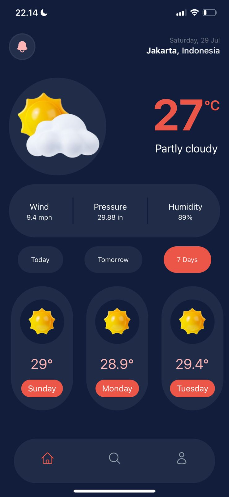

<h1>Weather Forecast App with React Native and Tailwind CSS</h1>

<h2>Deskripsi:</h2>
Weather Forecast App adalah sebuah aplikasi seluler yang dibangun dengan menggunakan teknologi React Native dan Tailwind CSS. Aplikasi ini memungkinkan pengguna untuk memeriksa perkiraan cuaca untuk berbagai lokasi di seluruh dunia.

<h2>Fitur Utama:</h2>

Tampilan Cuaca Saat Ini: Pengguna dapat melihat informasi cuaca saat ini untuk lokasi yang dipilih, termasuk suhu, kelembaban, kecepatan angin, kondisi cuaca, dan lainnya.

Perkiraan 7 Hari: Aplikasi menyediakan perkiraan cuaca untuk 5 hari ke depan, memungkinkan pengguna untuk merencanakan aktivitas mereka dengan bijaksana.

Pencarian Lokasi: Pengguna dapat mencari lokasi tertentu berdasarkan nama kota atau kode pos, dan aplikasi akan menampilkan perkiraan cuaca untuk lokasi tersebut.

Tampilan Responsif dengan Tailwind CSS: Antarmuka pengguna yang diimplementasikan dengan Tailwind CSS, memastikan tampilan responsif dan menarik di berbagai perangkat seluler.

Penggunaan Weather API: Aplikasi ini mengambil data cuaca dari layanan Weather API yang handal, sehingga pengguna selalu mendapatkan informasi terkini.

<h2>Teknologi yang Digunakan:</h2>

React Native: Menggunakan kerangka kerja ini memungkinkan pengembangan aplikasi lintas platform dengan JavaScript.

Tailwind CSS: Mempermudah styling dan menyesuaikan tampilan antarmuka pengguna dengan cepat.

Weather API: Mengakses data cuaca terbaru dari layanan API untuk menyajikan informasi yang akurat.

<h2>Instalasi:</h2>

1. Clone repository ini ke komputer lokal Anda.
2. Buka terminal dan arahkan ke direktori proyek.
3. Jalankan perintah `npm install` untuk menginstal semua dependensi.
4. Jalankan perintah `npm start` untuk memulai aplikasi.
5. Buka aplikasi di perangkat seluler Anda dengan menggunakan aplikasi Expo Go.

<h2>Preview:</h2>
Home Screen

Search Screen

!coming soon

Profile Screen

!coming soon

